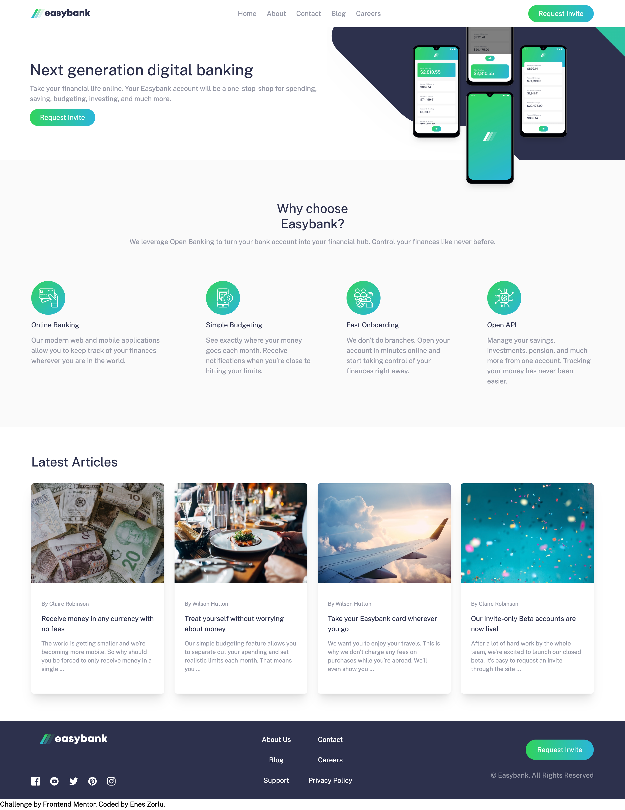

# Frontend Mentor - Easybank landing page solution

This is a solution to the [Easybank landing page challenge on Frontend Mentor](https://www.frontendmentor.io/challenges/easybank-landing-page-WaUhkoDN). Frontend Mentor challenges help you improve your coding skills by building realistic projects.

## Table of contents

-   [Overview](#overview)
    -   [The challenge](#the-challenge)
    -   [Screenshot](#screenshot)
    -   [Links](#links)
-   [My process](#my-process)
    -   [Built with](#built-with)
    -   [What I learned](#what-i-learned)
-   [Author](#author)

## Overview

### The challenge

Users should be able to:

-   View the optimal layout for the site depending on their device's screen size
-   See hover states for all interactive elements on the page

### Screenshot

### Links

-   Solution URL: [Solution](https://github.com/enszrlu/Easybank-landing-page-solution.git)
-   Live Site URL: [Live Site](https://your-live-site-url.com)

## My process

### Built with

-   Semantic HTML5 markup
-   CSS custom properties
-   Flexbox
-   CSS Grid
-   Mobile-first workflow
-   [tailwindcss](https://tailwindcss.com/) - CSS Framework

### What I learned

This is my first project using tailwindcss. I learned more about it. Couple bullet points below:

-   tailwindcss website searchbox helps a lot
-   Using @apply in css level clears out html significantly. Also allows quick changes to multiple components that uses same classes. Such as nav-links and cards
-   config file is very powerful to define custom colors and dimensions

## Author

-   Website - [github](https://github.com/enszrlu)
